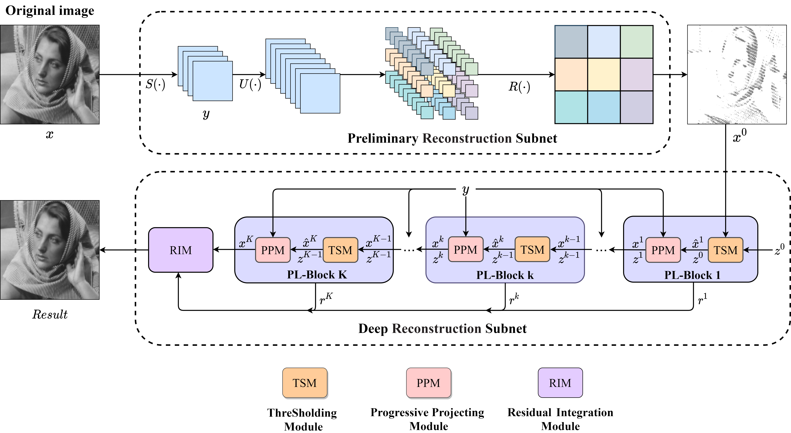
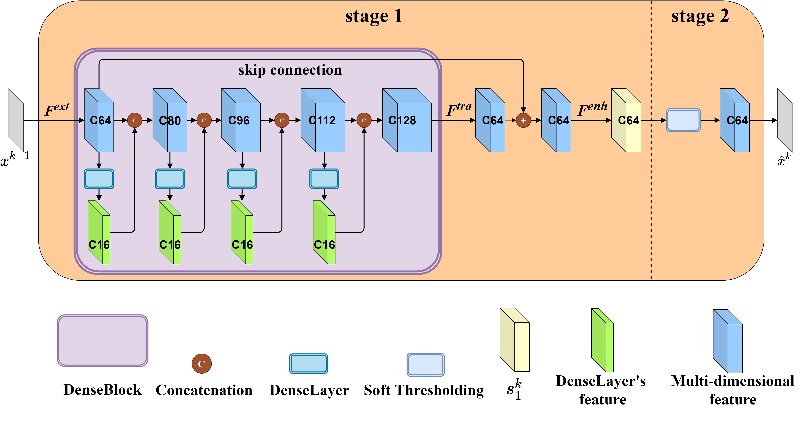
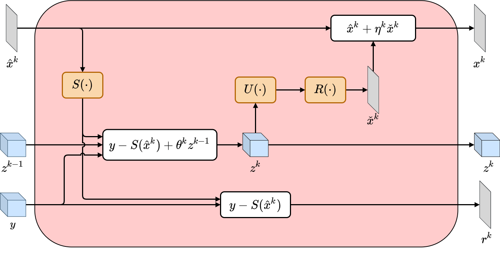
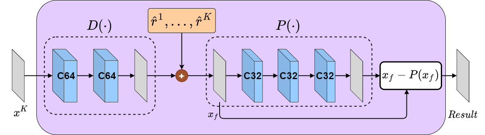
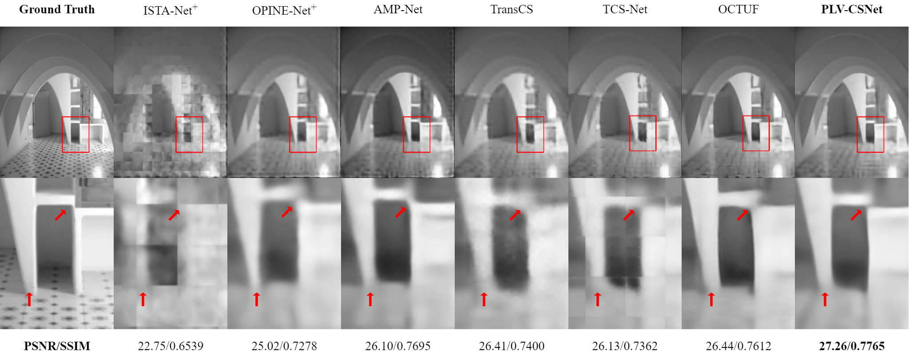
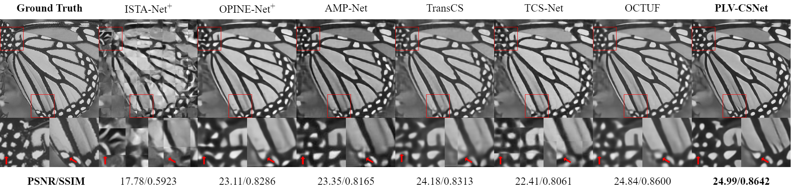
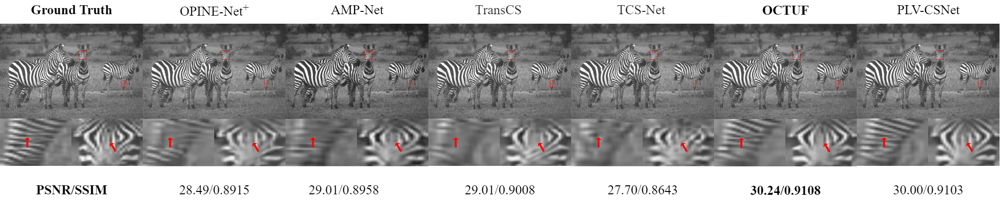

# PLV-CSNet: Projected Landweber Variant Unfolding Network for Image Compressive Sensing Reconstruction [PyTorch]

Abstract
--------

### Due to the powerful learning capability and fast processing speed of deep neural networks, a series of data-driven and deep unfolding networks for image reconstruction have emerged, achieving improved reconstruction quality. These reconstruction networks typically employ convolutional neural networks or residual neural networks to extract high-dimensional features of the dominant structure component. However, the edge and texture components in multi-dimensional features as well as the measurement residuals generated at each iteration during the unfolding procedure are often neglected, which would affect the quality of image reconstruction. In this paper, a Projected Landweber Variant Unfolding Network for Image Compressive Sensing Reconstruction (PLV-CSNet) is proposed for image compressive sensing reconstruction. A projected Landweber block (PL-Block) consisting of a thresholding module (TSM) and a progressive projecting module (PPM) is designed, along with a residual integration module (RIM). The TSM utilizes the dense block to fuse multi-dimensional image features and soft thresholding to eliminate image noise. The PPM combines the approximate message passing algorithm with deep neural networks to compute the projections of the approximation solution for images, as well as calculate the measurement residuals generated during each iteration step. Furthermore, by utilizing RIM, the measurement residuals can be employed to reconstruct the image residuals which are then flexibly supplemented back into the reconstructed image. The effectiveness of PLV-CSNet is demonstrated in four standard benchmark datasets, and comparisons with classical image compressive sensing reconstruction networks show that our network could achieve higher reconstruction accuracy. **

## Train

the training data file in `./datasets/train`, run:

```
python train.py
```

The model files will be in `./model`, respectively.

## Test

the model file `net_best.pth` in `./results`, run:

```shell
python test.py --testset_name=BSD68
```

The test sets are in `./test`.

## Results













